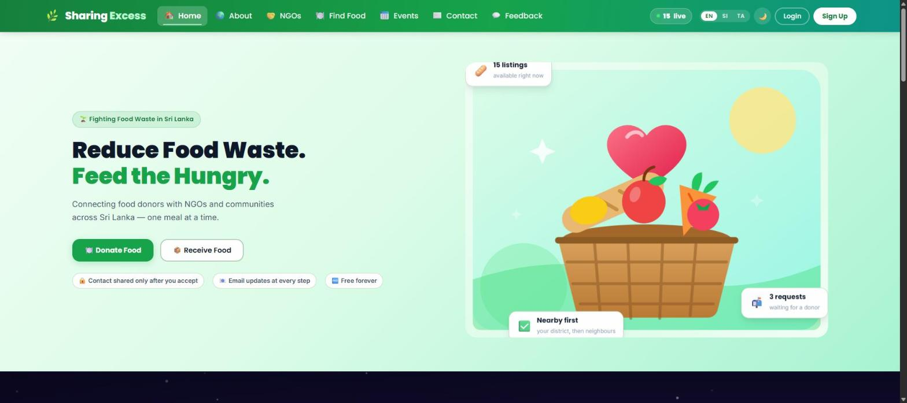
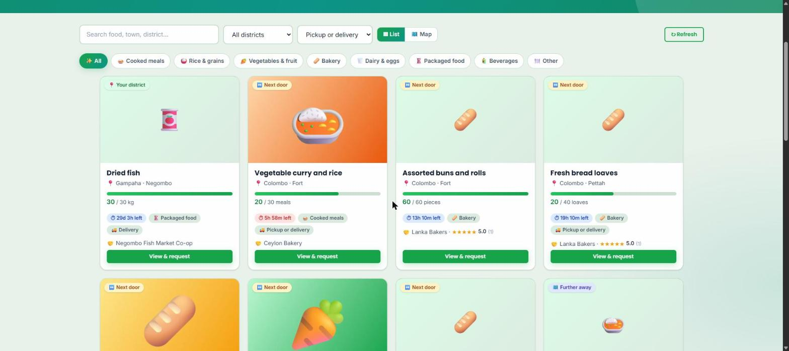
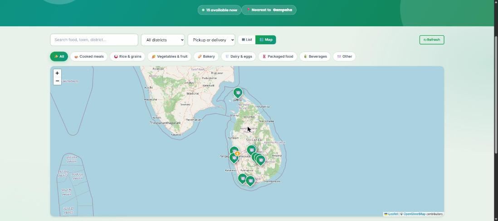
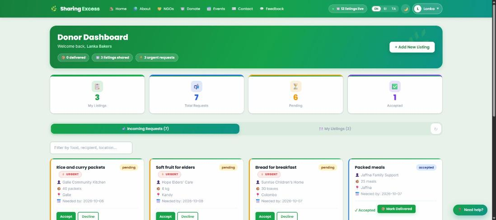
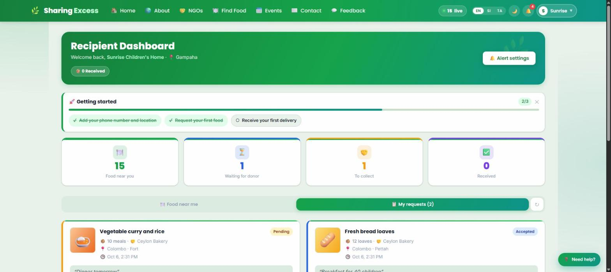
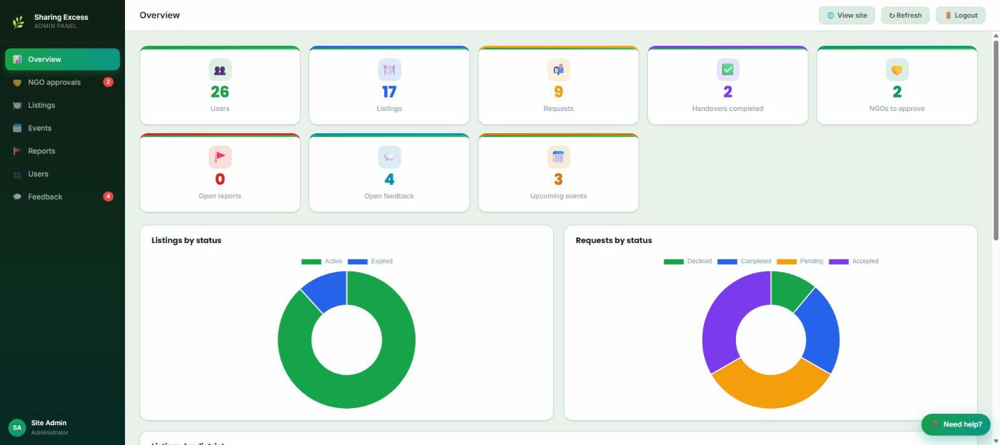
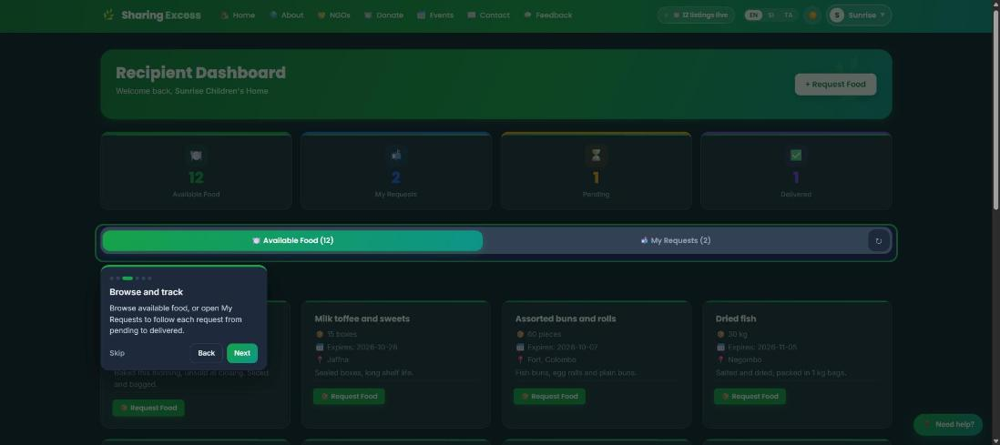

# 🍃 Sharing Excess

**A food-redistribution platform for Sri Lanka.** Restaurants, bakeries, hotels and farms list surplus food; children's homes, community kitchens and families request it; field staff verify every listing before it goes public. Built as a final-year project at Uva Wellassa University.



| Available food | Map view |
|---|---|
|  |  |

| Donor dashboard | Recipient dashboard |
|---|---|
|  |  |

| Admin panel | Guided tour (dark mode) |
|---|---|
|  |  |

> The screenshots show clearly-labelled **demo data** (`scripts/seed_demo.py`), not real donors or recipients.

---

## What it does

**Three kinds of account**

| Role | Can do |
|---|---|
| **Donor** | List surplus food with a photo, answer requests (accept / decline), mark deliveries, see their own listings and review status |
| **Recipient** | Browse and search available food (list or map), request it in one click or send a custom request, follow each request from pending to delivered, leave feedback |
| **Admin Officer** (`adminofficer`) | One staff role with all admin and officer powers: verify or reject listings (with a reason the donor sees), manage requests, users, donations and feedback, flag items for follow-up, export reports |

**Highlights**

- ✅ **Verification workflow** - new listings stay hidden until a staff member approves them
- 🗺️ **Map view** - listings placed by town on an OpenStreetMap map (no API key, no geocoding service)
- ⚡ **Live updates** - Server-Sent Events: a new request or listing appears on every open dashboard within a second, no refresh
- 🌐 **English / සිංහල / தமிழ்** and light / dark mode
- 📅 **Events** - staff publish food drives and volunteer sessions; signed-in users join (with spot limits), visitors can subscribe by email
- 🧭 **Guided tours and getting-started checklists** for every role
- 📱 **Installable on a phone** (PWA with an offline shell), responsive down to 320 px
- 📧 Email notifications on accept / decline / delivery, password reset and email verification
- 🔒 Per-route authorisation, rate limiting, image re-encoding that strips location metadata (see [Security](#security))

## Tech stack

| Layer | Technology |
|---|---|
| Frontend | React 19, Vite 8, TypeScript (core) + JavaScript (older pages), React Router 6, **TanStack Query**, **React Hook Form + Zod**, Chart.js, Leaflet |
| Backend | FastAPI, SQLAlchemy 2, **Pydantic Settings**, **Alembic** migrations, Pillow, slowapi |
| Database | PostgreSQL |
| Auth | JWT (HS256) + PBKDF2-SHA256 password hashing |
| Tests | pytest (122 tests) · Vitest + Testing Library (26 tests) |
| Delivery | Docker Compose (Postgres + API + nginx), GitHub Actions CI |

## Quick start (Windows)

Requirements: Python 3.11+, Node 20+, PostgreSQL running locally.

```bash
# 1. Database - create an empty one
createdb sharing_excess

# 2. Backend
cd backend
python -m venv .venv
.venv\Scripts\python -m pip install -r requirements-dev.txt
copy .env.example .env        # then edit: DATABASE_URL, SECRET_KEY (see the file for how to generate one)

# 3. Frontend
cd ..\frontend
npm install
copy .env.example .env
```

Then start everything with **`start-services.bat`** (stop with `stop-services.bat`):

| | URL |
|---|---|
| App | http://localhost:5175 |
| API | http://localhost:8003 |
| API docs (Swagger) | http://localhost:8003/docs |

The database schema is created and upgraded automatically on start-up (Alembic).

### Demo data and a first staff account

```bash
cd backend
.venv\Scripts\python -m scripts.seed_demo --yes      # 14 demo accounts, 14 listings, requests, reviews
.venv\Scripts\python -m scripts.seed_demo --remove   # remove only the demo data again
```

Demo accounts cannot sign in. Sign up normally in the app for your own donor / recipient accounts. To create a staff account, sign up, verify the email, then promote it once in the database:

```sql
UPDATE users SET role = 'adminofficer' WHERE email = 'you@example.com';
```

(Staff cannot be created through the app on purpose.)

## Run with Docker

```bash
copy .env.example .env      # set POSTGRES_PASSWORD and SECRET_KEY
docker compose up --build
```

App at http://localhost, API docs at http://localhost:8003/docs. Uploaded photos live in a named volume.

## Tests and checks

```bash
cd backend  && .venv\Scripts\python -m pytest -q        # API tests (use the dev database; they clean up after themselves)
cd frontend && npm test                                 # component and unit tests
cd frontend && npm run build                            # type-check + production build
```

CI (`.github/workflows/ci.yml`) runs all of the above on every push and pull request against a throw-away Postgres.

## Project layout

```
backend/
  app/
    main.py              app, middleware, startup migrations
    config.py            ALL settings (validated once, at start-up)
    models.py schemas.py dependencies.py   data model, API shapes, auth/role checks
    routers/             auth, listings, requests, feedback, calendar, community_events, officer (staff), donations, public, live
    utils/               jwt, uploads (image processing), email, rate limiter, live-update broadcaster
  alembic/               database migrations
  scripts/seed_demo.py   demo data
  tests/                 pytest suite
frontend/
  src/
    hooks/queries.ts     every server call (TanStack Query) + cache invalidation
    components/ tour/    shared UI, guided-tour engine
    lib/schemas.ts       form validation rules (Zod)
    i18n/                English / Sinhala / Tamil text
docker-compose.yml       Postgres + API + nginx
```

## Security

Written down so a reviewer doesn't have to hunt for it:

- **Identity comes from the login token, never from the request.** Creating a listing or request, answering a request, posting feedback and deleting anything all use the signed-in user; ids in a request body are ignored.
- **Role and ownership checks** on every write: donors answer only requests on their own listings, recipients change only their own requests, staff routes need the staff role.
- **Privacy:** recipients' phone and email are visible only to staff and the donor in the same exchange; the public home page uses a counts-only endpoint.
- **Uploads are decoded and re-encoded** as WebP (max 1600 px), which rejects non-images and removes EXIF/GPS data from phone photos.
- **Rate limits** on login, signup, verification, password reset, contact and password change.
- The app **refuses to start** without a `SECRET_KEY` of 32+ characters; secrets live in `.env` (git-ignored), never in code.
- Staff accounts can't be created by signup or by promoting a user in the UI, and can't be suspended or deleted from the panel.

## Known limitations

- **Live updates run in one process.** Run a single API worker (as the Docker image does), or replace `app/utils/events.py` with Redis pub/sub before scaling out.
- **Tokens last 7 days** and are not revoked on password change (a token-version column would fix this).
- **Payments are sandbox only** (PayHere sandbox). Use real merchant credentials before taking real money.
- **The map places listings by town name** from a built-in table of about 65 Sri Lankan places; a listing whose location isn't recognised appears in the list view only.
- Several older pages are still JavaScript (not TypeScript) and the admin panel uses direct `fetch` calls rather than the shared query hooks.
- Contact details on the About / Contact pages (phone, email, social links) are placeholders.

## Team

Developed by **Induwara Ihalavithana**, Uva Wellassa University.
